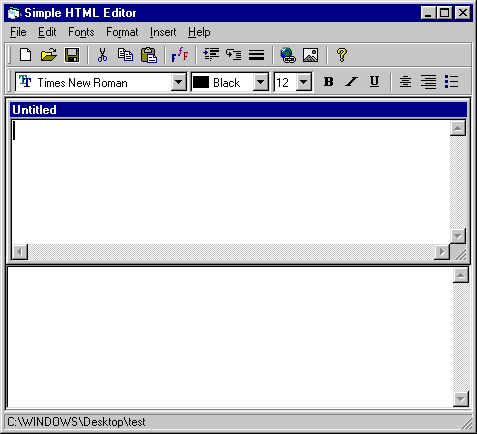



## Simple HTML Editor

### Description

This is a Simple HTML Editor ALL ORIGINAL CODE. Has a split bar between edit window and browser window via use of MDIForm. Waits for the user to finish typing before updating browser control. Demonstrates use of toolbar, file dialog, font dialog, imagecombos, clipboard controls, sendkeys, wait module, multiple forms and a few other things. I am new to Visual Basic, but I feel this code belongs in the intermediate section due to the logic behind the simple commands. I have had a bit of experience in the creation of HTML Editors. My primary one is at http://nodnarbsoftware.com, not that I am pitching that editor, just establishing credentials. Please vote for me, granted I didn't use any spectacular API protocols or break through controls, just the proper use of good old Visual Basic in raw form.

*Note* Updated version, removed coolbar for those w/o enterprise edition.
 
### More Info
 

             |
---                |---
**Submitted On**   |2002-01-30 22:54:38
**By**             |[Brandon Cunningham](https://github.com/Planet-Source-Code/PSCIndex/blob/master/ByAuthor/brandon-cunningham.md)
**Level**          |Intermediate
**User Rating**    |4.0 (16 globes from 4 users)
**Compatibility**  |VB 6\.0
**Category**       |[Complete Applications](https://github.com/Planet-Source-Code/PSCIndex/blob/master/ByCategory/complete-applications__1-27.md)
**World**          |[Visual Basic](https://github.com/Planet-Source-Code/PSCIndex/blob/master/ByWorld/visual-basic.md)
**Archive File**   |[Simple\_HTM520191312002\.zip](https://github.com/Planet-Source-Code/brandon-cunningham-simple-html-editor__1-31308/archive/master.zip)

